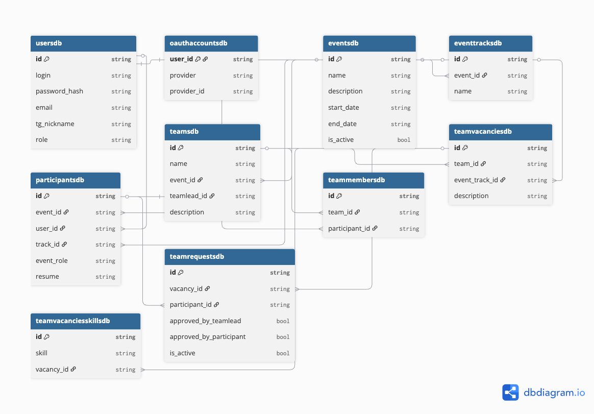
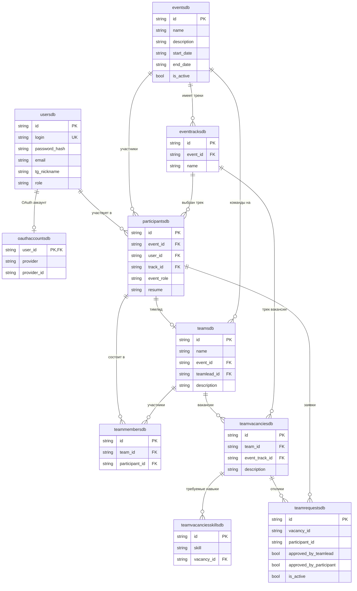

# FindMyTeam

Веб-приложение для поиска команд на хакатоны и командные олимпиады (такие как DANO, PROD и т.д.).
Помогает участникам быстро объединяться в сильные команды.

---

## Возможности

### Участник
- Регистрация на мероприятие, выбор трека (бэкенд, фронтенд, мобильная разработка и др.)
- Создание резюме с указанием стека и навыков
- Просмотр вакансий в командах с сортировкой по релевантности
- Отклик на вакансии, просмотр профилей и контактов участников

### Тимлид
- Создание команды и открытие вакансий с требуемыми навыками
- Сортировка участников с ранжированием по совпадению стека
- Приглашение участников на открытые вакансии
- Управление откликами и составом команды

### Организатор
- Создание и настройка мероприятий с треками
- Мониторинг зарегистрированных участников и команд
- Блокировка нарушителей правил мероприятия

---

## Стек технологий

| Слой | Технологии |
|------|-----------|
| **Backend** | Python 3.13, FastAPI, Uvicorn (ASGI) |
| **ORM / БД** | SQLAlchemy 2, SQLModel, PostgreSQL 15, asyncpg |
| **Миграции** | Alembic |
| **Аутентификация** | JWT (access + refresh tokens), OAuth 2.0 (Google) через Authlib |
| **Админ-панель** | SQLAdmin |
| **Frontend** | React 19, Vite, Material UI 7, React Router 7 |
| **Инфраструктура** | Docker, Docker Compose, Nginx |
| **Тестирование** | pytest, pytest-asyncio |

---

## Архитектура

Backend построен по принципам **Clean Architecture** с чётким разделением на 4 слоя:

```
┌─────────────────────────────────────────────────┐
│                  API (Presentation)             │
│         routes/  dto/  dependencies.py          │
├─────────────────────────────────────────────────┤
│               Application (Use Cases)           │
│                    services/                    │
├─────────────────────────────────────────────────┤
│                     Domain                      │
│          models/   interfaces/   exceptions     │
├─────────────────────────────────────────────────┤
│                 Infrastructure                  │
│    db/repositories   oauth/   token   sorter    │
└─────────────────────────────────────────────────┘
```

внешние слои зависят от внутренних, то есть зависимости направлены внутрь

### Структура backend

```
backend/src/
├── api/                          # Presentation layer
│   ├── routes/                   # Эндпоинты (users, events, teams, participants, team_requests)
│   ├── dto/                      # Request/Response схемы
│   └── dependencies.py           # Dependency Injection — сборка зависимостей
│
├── application/                  # Application layer
│   └── services/                 # Бизнес-логика (UsersService, TeamsService, ...)
│
├── domain/                       # Domain layer (ядро, без внешних зависимостей)
│   ├── models/                   # Доменные модели (Pydantic)
│   ├── interfaces/               # Интерфейсы для репозиториев и всего, что находится в инфраструктуре
│   └── exceptions.py             # Доменные исключения (404, 403, 409, ...)
│
├── infrastructure/               # Infrastructure layer
│   ├── db/
│   │   ├── db_models/            # ORM-модели (SQLModel)
│   │   ├── repositories/         # Реализации репозиториев
│   │   ├── session.py            # Async session factory
│   │   └── alembic/              # Миграции
│   ├── oauth/                    # OAuth-провайдеры
│   ├── token_creator_impl.py     # JWT: создание и верификация токенов
│   ├── hash_creator_impl.py      # Хеширование паролей
│   └── sorter_impl.py            # Сортировка по релевантности - реализация сортировщика
│
├── core/
│   ├── config.py                 # Pydantic Settings - конфигурация из .env
│   └── init_data.py              # Инициализация БД и суперадмина
│
└── main.py                       # Основная точка входа - FastAPI app, middleware, маршруты
```

### Ключевые архитектурные решения

- **Инверсия зависимостей** — интерфейсы определены в `domain/interfaces/` через `Protocol`, реализации — в `infrastructure/`. Сервисы зависят от абстракций, а не от конкретных реализаций.
- **Base Repository** — базовый репозиторий с типизацией `[Model, ReadModel, CreateModel, UpdateModel]`, конкретные репозитории расширяют его доменными запросами.
- **Dependency Injection** — через FastAPI `Depends()`: каждый сервис получает свои зависимости при создании, цепочка собирается в `dependencies.py`.
- **Сортировка по релевантности** — PostgreSQL `ts_vector` / `ts_rank_cd` с поддержкой русского языка и взвешенным ранжированием по совпадению трека и навыков.
- **Async-first** — все I/O операции асинхронные (asyncpg), параллельные запросы к БД через `asyncio.gather()`.

---

## ER-диаграмма





---

## Запуск


### 1. Клонирование

```bash
https://github.com/GlebNes109/FindMyTeam.git
cd FindMyTeam
```

### 2. Настройка переменных окружения

Создайте файл `.env` в корне проекта:

```env
# Database
POSTGRES_USERNAME=postgres
POSTGRES_PASSWORD=your_password
POSTGRES_HOST=db
POSTGRES_PORT=5432
POSTGRES_DATABASE=findmyteam

# App
SERVER_ADDRESS=http://localhost:8080
FRONTEND_URL=http://localhost
SECRET_KEY=your_secret_key
ALGORITHM=HS256

# Admin panel
ADMIN_LOGIN=admin
ADMIN_PASSWORD=your_admin_password
ADMINS=["ADMIN, SUPER_ADMIN"]

# OAuth (Google)
CLIENT_ID_GOOGLE=your_google_client_id
CLIENT_SECRET_GOOGLE=your_google_client_secret
```

### 3. Запуск

```bash
docker compose up --build
```

После запуска:
- **Frontend**: http://localhost
- **Backend API**: http://localhost:8080
- **Swagger UI**: http://localhost:8080/docs
- **Админ-панель**: http://localhost:8080/admin

---

## API

Основные группы эндпоинтов:

| Префикс | Описание |
|---------|---------|
| `/users` | Регистрация, авторизация, OAuth, профиль |
| `/events` | CRUD мероприятий, управление треками |
| `/participants` | Регистрация на мероприятие, резюме |
| `/teams` | Команды, вакансии, участники |
| `/team_requests` | Отклики и приглашения |

Полная документация доступна в Swagger после запуска: http://localhost:8080/docs